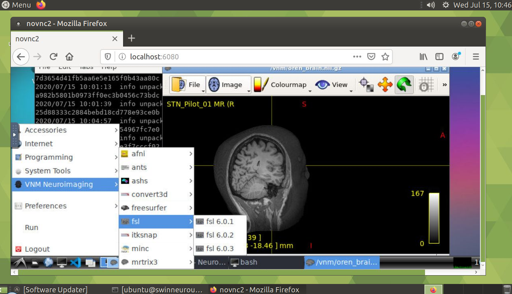

# Virtual Neuro Machine

A compact Docker container with a browser-accessible environment for reproducible neuroimaging analysis. Only the required applications, already pre-installed, are downloaded from a public library (downloaded as containers).

You're welcome to complete the survey to help guide future additions to the software library: https://forms.gle/deKy85yniJLP4hDM8

To post an inquiry, please go to the "Discussions" tab of the NeuroDesk project (https://github.com/NeuroDesk/neurodesk/discussions), and press the "New Discussion" button. Alternatively, contact Steffen Bollmann (https://github.com/stebo85), Oren Civier (https://anif.org.au/team/oren-civier/) or Aswin Narayanan (https://github.com/aswinnarayanan).

2-minutes tutorial video from OHBM 2021: https://www.youtube.com/watch?v=JLv_5fycugw

Neurodesk/VNM website: https://neurodesk.github.io/



## Minimum System Requirements
1. Atleast 3GB free space for VNM base image
2. Docker requirements. Details found under https://docs.docker.com/get-docker/
3. (Windows Users) If installing docker using WSL, atleast 20GB space recommended for WSL with Ubuntu

## Quickstart
1. Install Docker from here: https://docs.docker.com/get-docker/ (Mac, Windows, Linux; for HPC/supercomputer: https://github.com/NeuroDesk/neurodesk)

2. Create a local folder where the downloaded applications will be stored, e.g. ~/vnm in Mac and Linux, or C:\vnm in Windows 

3. Open a terminal, and type the folowing command to automatically download the VNM container and run it (Mac, Windows, Linux commands listed below) 

* Mac:
```
docker run --privileged --name vnm -v ~/vnm:/vnm -e USER=neuro -p 6080:80 vnmd/vnm:20210708
```
(notice: There is a bug in docker 3.3.0 for Mac that makes this command not run correctly and there will be no application menu when you start the desktop. Update your docker version when you see this!)

* Windows:
```
docker run --privileged --name vnm -v C:/vnm:/vnm -e USER=neuro -p 6080:80 vnmd/vnm:20210708
```
* Linux:
```
sudo docker run --privileged --name vnm -v ~/vnm:/vnm -v /dev/shm:/dev/shm -e USER=neuro -p 6080:80 vnmd/vnm:20210708
```
(notice: if you get errors in VNM then check if the ~/vnm directory is writable to all users, otherwise run `chmod a+rwx ~/vnm`)

4. Once VNM is downloaded i.e. "INFO success: novnc entered RUNNING state" is displayed in terminal, open a browser and go to:
```
http://localhost:6080
```
or open a VNC Client and connect to port 5900 (for this -p 5900:5900 has to be added to the docker call)

5. VNM is ready to use!

(The sudo default sudo password is "ubuntu")

## Stopping VNM:
When done processing your data it is important to stop and remove the container - otherwise the next start or container update will give an error ("... The container name "/vnm" is already in use...")
1. Click on the terminal from which you ran VNM

2. Press control-C

3. Type:
```
docker stop vnm
```
4. Type:
```
docker rm vnm
```

## How to access files from your Host computer?
The `-v C:/vnm:/vnm` part of the docker command links the directory "vnm" on the "C drive" of your Windows computer to the directory /vnm inside the VNM. Everything you store in there will be available inside VNM and on the host computer. You can also mount additional directories by adding another -v parameter set (e.g. `-v D:/moredata:/data`) - this will mount the directory moredata from your D drive to /data inside VNM. 

## How to launch/download applications
Click on the Launcher icon in bottom-left corner and navigate to the "VNM Neuroimaging" menu, then select the application and version you wish to launch. If it is the first time you launch the application, it will be downloaded to your desktop environment. The application is ready to use when the "Singularity>" propmpt appears in the terminal window that opens. If you chose in the menu the GUI of the application (e.g., fsleyesGUI 6.0.3), it will open automatically. If you chose tha application itself (e.g., fsl 6.0.3), a terminal window will open, and you can use it to run any of the utilities packaged with the application, including the grphical utilities (e.g., typing "fsl" to run FSL's main menu).

Alternatively one can download an application from the command line, e.g.:
```
bash /neurodesk/local/fetch_and_run.sh fsl 6.0.3 20200905
```
(Notice: last argument is to be taken from https://github.com/NeuroDesk/neurodesk/blob/master/neurodesk/apps.json)


## Applications
### List of available software in the Desktop (no need to download! already included in main container)
* Git 2.25.1 (version control)
* Lmod 6.6 (for handling different versions of software)
* Nipype 1.5.0 (workflow system for neuro-imaging)
* Python 3.8.2 (programming language)
* Rsync 3.1.3 (synchronization of data)
* Singularity 3.7.0 (container runtime)
* Visual Studio Code 1.46.1 (code editor and development environment)

### List of all available images:
https://github.com/NeuroDesk/neurocontainers/packages

### List of all tested images available in neurodesk:
https://github.com/NeuroDesk/neurodesk/blob/master/neurodesk/apps.json
```
curl -s https://raw.githubusercontent.com/NeuroDesk/neurodesk/master/neurodesk/apps.json
```

### How to use applications from the command line
1. Open a terminal window (there is a terminal icon in the task bar)
2. Examine the list of downloaded applications that shows up in the terminal window. If the desired application is not there, follow the instructions under "How to launch/download applications" above (https://github.com/NeuroDesk/vnm/blob/master/README.md#how-to-launchdownload-applications)
3. Use the 'module' command, giving the desired downloaded application as an argument, e.g.
```
module load fsl_6.0.3
```
4. Call the utility included in the application as you would do if it was installed on your desktop, e.g.
```
fsleyes
```

## Desktop interface
* window tiling is set to: SHIFT-ALT-CTRL-{left,right,up,down}
* There are two workspaces available. To shift between them, click on the miniature image of the desired workspace, just right of the icons displayed on the far left of the task bar.

## Advanced instructions
- [Run Neurodesk VNM for free on cloud providers](https://github.com/NeuroDesk/vnm/wiki/Run-Neurodesk-VNM-for-free-on-cloud-providers)
- [Start with custom screen resolution for VNC Viewer](https://github.com/NeuroDesk/vnm/wiki/Start-with-custom-screen-resolution-for-VNC-Viewer)
- [Change screen resolution in browser without restarting VNM](https://github.com/NeuroDesk/vnm/wiki/Change-screen-resolution-in-browser-without-restarting-VNM)
- [Mount Volume using SSHFS](https://github.com/NeuroDesk/vnm/wiki/Mount-volume-using-SSHFS)
- [Not enough free space](https://github.com/NeuroDesk/vnm/wiki/Not-enough-free-space)
- [Technical details](https://github.com/NeuroDesk/vnm/wiki/Technical-Details)

## Acknowledgments


